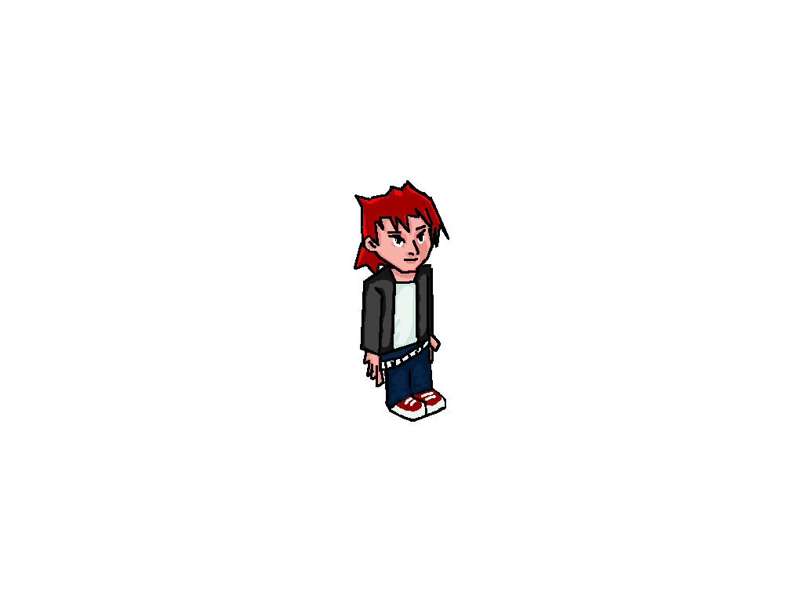

# MAD-RID: Isometric 2D Puzzle Game

## Description
Isometric 2D Puzzle Game made using Unity. Development by [banacchini](github.com/banacchini), Design and Art by [🎨itziart](https://www.artstation.com/itziart). The other passengers are blocking your way out! Fulfill their needs by interacting with them and leave the train. Includes:


## [Full Gameplay Video](https://youtu.be/lC5BluAmAKI)

## Features


### Player-NPC Interactions: 
Engage with various characters, each with their unique needs and dialogues.
- **Item Interactions:** Combine items or use them with NPCs to solve puzzles and progress.
- **Isometric 2D View:** Enjoy a visually appealing isometric perspective that adds depth to the gameplay.
- **Creative Level Design:** Navigate through thoughtfully designed levels that challenge your problem-solving skills.

## Media

## Installation
1. Clone the repository:
    ```bash
    git clone https://github.com/itziart/MAD-RID.git
    ```
2. Open the project in Unity.
3. Build and run the game.

## Credits
- **Development:** [Your Name](https://github.com/banacchini)
- **Design and Art:** [Itziart](https://github.com/itziart)

## License
This project is licensed under the MIT License - see the [LICENSE](LICENSE) file for details.

## Contact
For any inquiries, please contact [Your Email](mailto:your.email@example.com).
